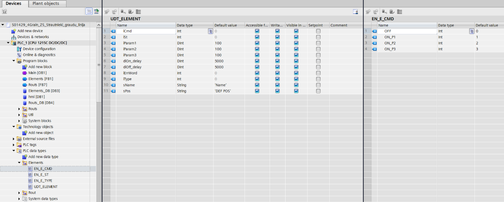
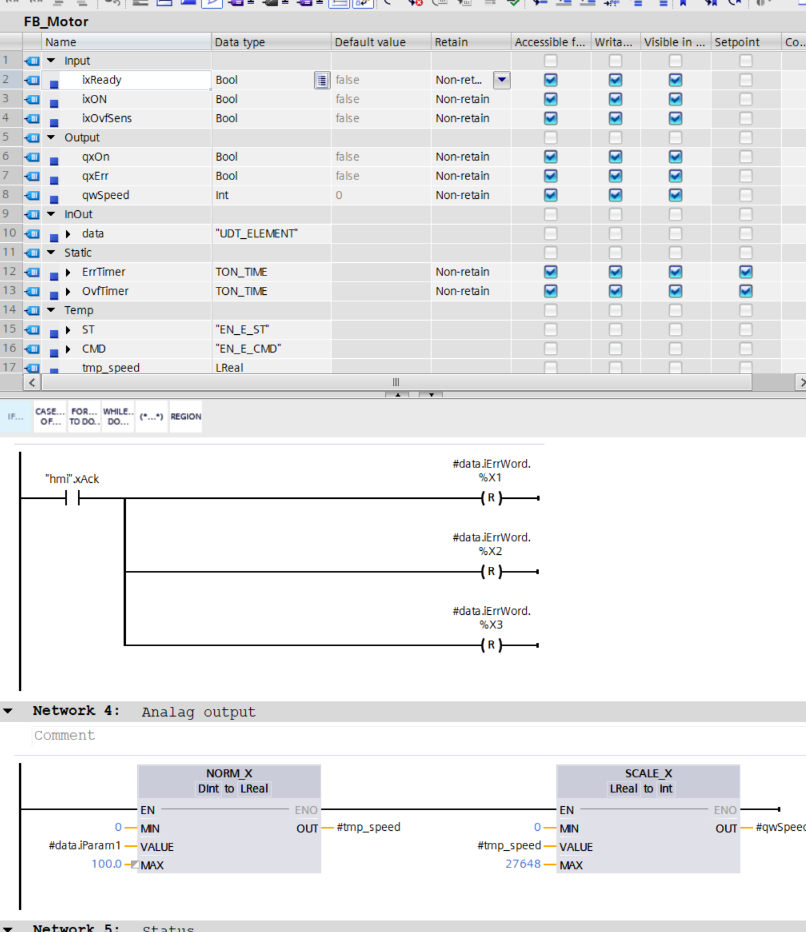
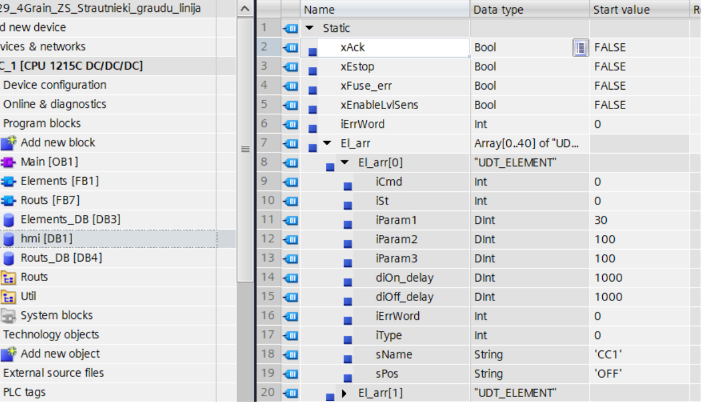
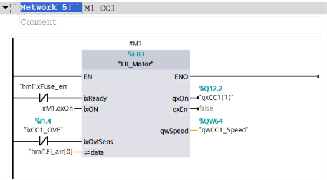
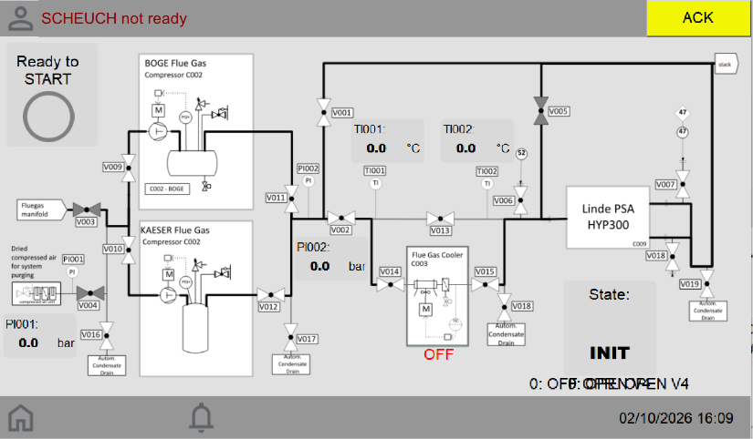
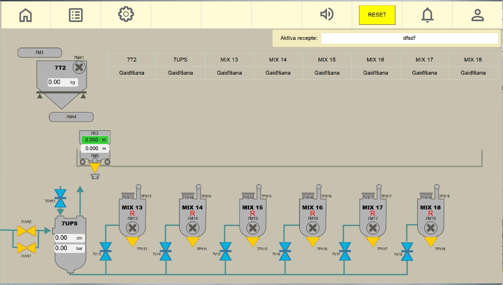
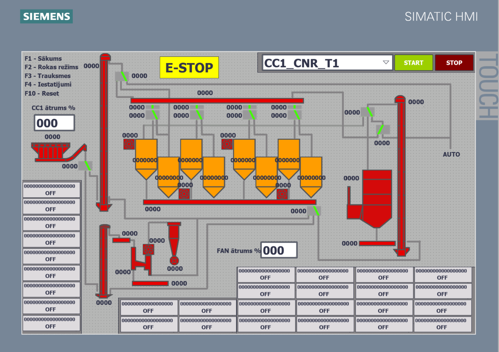

# PLC_projekts

Sveiki! Šeit ir instrukcija darba uzdevuma izpildei:

### 1. Darba vides sagatavošana
* Lejupielādē darba vidi, izmantojot pogu **Download ZIP**.

* Atarhivē mapi un visas tālākās darbības veic tikai šajā mapē.
* Galarezultātu atstāj tajā pašā mapē.

### 2. Uzdevuma izpilde
* Strādā **PLC** un **HMI** mapēs.
* Gatavos PLC un HMI projektus ievieto tiem atbilstošajās mapēs.

### 3. Git un versiju kontrole
* Mēs ikdienā izmantojam **Git** versiju kontroli, tāpēc pirms darba sākšanas iepazīsties ar tā darbības pamatprincipiem un **Git Desktop** lietošanu.

### 4. Darba nodošana
* Kad uzdevums ir pabeigts, sazipo darba mapi un nosūti to mums atpakaļ.

Veiksmi darbā!

# 🚀 Darba uzdevums

Zemāk ir aprakstīts konkrētais darba uzdevums. Visus izstrādei nepieciešamos failus atradīsi projekta mapē.

> **Piezīme:** Šis uzdevums ir ņemts no reāla projekta, taču pilnu projektu realizēt nav nepieciešams — tev būs jāizveido loģika tikai dažiem procesa posmiem.

> Šeit nav sniegts pilns detalizēts risinājuma apraksts, bet gan tikai galvenie principi un uzdevumi. Tādēļ tev pašam būs jāpieņem inženiertehniskie lēmumi par to, ko un kā vislabāk uzbūvēt.

### 🛠️ Izmantojamā programmatūra
* **PLC daļai:** Siemens **TIA Portal**
* **HMI daļai:** **EasyBuilder Pro** (Weintek)

Izmanto sev ērtākās šo programmu versijas.

---

> **Svarīgi par PLC programmēšanas valodām:**
> PLC projektā drīkst izmantot **tikai Ladder (LAD)** un **Structured Text (ST / SCL)** valodas. 
> FBD un citas valodas projektā **neizmantojam**.

## ⚙️ PLC 1. uzdevums

Mapē atradīsi **IO sarakstu**, kurā norādīti PLC modeļi, ieeju/izeju saraksts un iekārtu saraksts.

Projektā obligāti jāizmanto **objektorientēta pieeja**:
* Vispirms jāizveido funkciju bloki visām iekārtām, kas atkārtojas (motors, vārsts u.c.).
* Visa pārējā loģika, kas saistīta ar iekārtu vadību, tiek realizēta, vēršoties pie šiem funkciju blokiem vai saistītajiem datu blokiem (DB).

#### Izstrādes gaita:
1. **Datu struktūras (UDT):**
   * Izveido lietotāja definētās datu struktūras (`UDT`), kas apraksta visus iekārtai nepieciešamos datus: vadības komandas, statusus, trauksmes un iestatījumus.
   
2. **Funkciju bloki (FB):**
   * Izveido funkciju blokus, kas pieņem visus ar iekārtas darbību saistītos I/O signālus (statusa signālus, devējus, izejas) un `IN_OUT` mainīgo, kas pieņem attiecīgā elementa `UDT`.
   * Visu loģiku bloka iekšienē realizē, izmantojot tikai `UDT` un funkciju bloka mainīgos.
   
3. **Datu bloks (DB) un komunikācija:**
   * Izveido globālo datu bloku, kurā inicializē visus `UDT` un iekārtu aprakstošos mainīgos (šis datu bloks vēlāk tiks izmantots komunikācijai ar HMI).
   
4. **Bloku inicializācija:**
   * Izsauc funkciju blokus galvenajā programmā, piesaistot datu bloka struktūras un reālās I/O no PLC moduļiem.
   

> **Piezīme par inicializāciju:** Inicializē tikai tās iekārtas, kas būs tieši nepieciešamas **2. PLC uzdevuma** izpildei!

---

### Nepieciešamie funkciju bloki

Tev jāizveido funkciju bloki un UDT šādām iekārtām:
* **Motors**
* **Vārsts**
* **Silosi**

> **Svarīgi loģikā:**
> Izpēti IO sarakstu! Motoru un citu iekārtu funkciju blokā jāparedz ārējie apturēšanas signāli un aizsardzības. Uztaisi maksimālās komplektācijas funkciju bloku ar iespēju atslēgt vai apiet nevajadzīgās funkcijas tām iekārtām, kurām dažu devēju nav, bet pamata darbības loģika nemainās.

---

### 📋 PLC 1. uzdevuma kopsavilkums:
1. **Izpēti IO** sarakstu.
2. **Izveido UDT un funkciju blokus** iekārtām, kas atkārtojas (Motors, Vārsts, Siloss).
3. **Inicializē iekārtu funkciju blokus un datu bloku** priekš HMI, izmantojot UDT un reālās PLC ieejas/izejas.

## ⚙️ PLC 2. Uzdevums: Procesa loģikas un maršruta izstrāde

Šajā uzdevumā tev jāizveido automātiskā procesa vadības loģika, izmantojot 1. uzdevumā izveidotos iekārtu objektus (UDT / FB). 

> **Svarīgi nosacījumi:**
> * Visas darbības ar iekārtām tiek veiktas **tikai caur to objektiem** (piemēram: dod komandu motoram ieslēgties, atvērt vārstu pozīcijā Nr. 1 u.tml.).
> * Tiešā vēršanās pie reālajām I/O ir pieļaujama tikai tādiem elementiem, kas nav saistīti ar atsevišķu iekārtu iekšējo loģiku (piemēram, avārijas stop pogas vai citi vispārējās biznesa loģikas signāli).

---

### 🗺️ Tehnoloģiskais uzdevums:
Izpēti pievienoto **tehnoloģisko shēmu**. Tev jāizstrādā automātiskā maršruta vadības loģika līnijai: **`SILO1` ➔ `PILE1`**.

#### 1. Maršruta palaišana (Start):
* Operators nospiež pogu **"Ieslēgt maršrutu"** (*pagaidām PLC mainīgais*).
* PLC pārbauda, vai visas maršrutā iesaistītās iekārtas ir bez kļūdām (`OK`).
* Ja viss ir kārtībā, sākas iekārtu ieslēgšana/pārslēgšana pareizajās pozīcijās.
* **Ieslēgšanas secība:** Notiek virzienā **no maršruta gala uz sākumu** (piem., `DV4`, `E3`, ...).
 Iekārtas tiek ieslēgtas secīgi ar **regulējamu laika aizkavi** (motorus ieslēdzam, vārstus pārslēdzam vajadzīgajā pozīcijā).

#### 2. Maršruta apturēšana (Stop):
* Maršruts tiek izslēgts, ja:
  * Operators nospiež pogu **"Izslēgt maršrutu"** (*PLC mainīgais*), **vai**
  * Siloss (`SILO1`) kļūst tukšs.
* **Izslēgšanas secība:** Notiek virzienā **no maršruta sākuma uz galu** (piem., `SILO1`, `SH1`, ...) ar regulējamu laika aizkavi, lai attīrītu līnijas.

#### 3. Maršruta statusa uzskaite:
* Izveido mainīgo, kas ataino maršruta pašreizējo statusu:
  * `OFF` (Izslēgts)
  * `NOTIEK STARTS` (Sākšanas process)
  * `DARBS` (Aktīvs darba režīms)
  * `IZSLĒGŠANA` (Secīgās apturēšanas process)
  * `KĻŪDA` (Sistēmas trauksme)

#### 4. Drošība un avārijas apturēšana:
* Ja laikā, kad maršruts ir aktīvs (*DARBS* vai *STARTS*), kādai no maršrutā iesaistītajām iekārtām rodas **kļūda**, viss maršruts un visas tajā esošās iekārtas tiek **izslēgtas momentāni** (bez aizkaves).

## 🖥️ HMI Uzdevums: Vizualizācija un komunikācija

Šajā daļā tev vajadzēs savienot PLC ar HMI, attēlot iekārtu un maršruta statusus, kā arī konfigurēt iebūvēto kļūdu sarakstu.

Projektā tiek izmantots **Weintek HMI**. Tā izstrādes vide (**EasyBuilder Pro**) ir bez maksas un lejupielādējama no ražotāja oficiālās mājaslapas.

---

### 1. PLC un HMI komunikācijas iestatīšana
* Izveido projektu atbilstošajam Weintek HMI modelim.
* Importē nepieciešamos datus no PLC projekta, lai tos izmantotu vizualizācijā.
* **Ieteicamais komunikācijas draiveris:** `Siemens S7-1200 (Absolute Addressing)` *(var izmantot arī citu sev ērtu draiveri)*.
* IP adreses šobrīd nav būtiskas — galvenais ir veiksmīgi importēt tagus.

#### 💡 Tagu importēšanas gaita (`Import Tags`):
1. EasyBuilder Pro nospied pogu **Import Tags**.
2. Izvēlies iespēju importēt datus tieši no TIA Portal projekta vai konkrēta DB faila *(rekomendējam importēt visu TIA Portal projektu un atzīmēt tikai vajadzīgos DB)*.

 ⚠️ **Svarīgi:** Pirms TIA Portal projekta importēšanas EasyBuilder Pro vidē, **TIA Portal programmai obligāti jābūt aizvērtai!**

---

### 2. Vizualizācijas prasības

Kad dati ir sasaistīti, izveido vizualizācijas saskarni. Dizains šobrīd nav prioritāte — galvenais ir nodrošināt pilnu funkcionalitāti *(tomēr vari brīvi izpausties!)*.

**Saskarnē obligāti jāattēlo:**
* **`CC2` statusu** (piemēram: `OFF`, `ON`, `KĻŪDA` u.c.).
* **Maršruta statusu** (`OFF`, `STARTS`, `DARBS`, `IZSLĒGŠANA`, `KĻŪDA`).
* **Maršruta vadības pogas:** "Ieslēgt maršrutu" un "Izslēgt maršrutu".
* **Kļūdu sarakstu:** Konfigurē `CC2` kļūdu signālus iebūvētajā HMI kļūdu/trauksmes (Alarm List) logā.

---

> ℹ️ *Zemāk atradīsi mūsu esošās vizualizācijas piemērus iedvesmai.*

